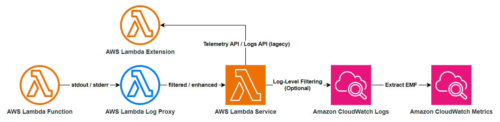

# AWS Lambda Log Proxy

[](https://crates.io/crates/aws-lambda-log-proxy)




Filter or transform logs from AWS Lambda functions before they are sent to CloudWatch Logs.

## Usage

### Installation

Add the following to the `dependencies` in your `Cargo.toml`:

```toml
aws-lambda-log-proxy = "0.1"
```

or run:

```bash
cargo add aws-lambda-log-proxy
```

### Examples

WIP: an executable aws-lambda-log-filter is coming soon.

### [Documentation](https://docs.rs/aws-lambda-log-proxy/0.1.0)

## Why We Need This?

We need a solution to realize the following features **_without modifying the existing code_** of AWS Lambda functions:

- Reduce the volume of logs to lower the costs.
- Wrap existing logs in JSON with customizable level and field name, so we can use the [built-in Lambda Log-Level Filtering](https://aws.amazon.com/blogs/compute/introducing-advanced-logging-controls-for-aws-lambda-functions/) to filter them.
- But keep the [EMF](https://docs.aws.amazon.com/AmazonCloudWatch/latest/monitoring/CloudWatch_Embedded_Metric_Format_Specification.html) logs untouched so we can still retrieve the metrics.

## How It Works?

We use [AWS Lambda Runtime Proxy](https://github.com/DiscreteTom/aws-lambda-runtime-proxy) to spawn the handler process as a child process of the proxy to intercept the logs, then suppress the [`invocation/next`](https://docs.aws.amazon.com/lambda/latest/dg/runtimes-api.html#runtimes-api-next) request until all logs are processed.

## Performance

The processing of logs is done in a separate process asynchronously, so it won't block the main handler process. Besides, we only suppress the [`invocation/next`](https://docs.aws.amazon.com/lambda/latest/dg/runtimes-api.html#runtimes-api-next) request but not the [`invocation/response`](https://docs.aws.amazon.com/lambda/latest/dg/runtimes-api.html#runtimes-api-response) request, so the synchronous invocator like AWS API Gateway won't be blocked by the processing of logs.

However, if you do something cpu-intensive in the log processing, it may still affect the performance of the main handler process, since the proxy process and the handler process share the same CPU and memory resources. Increase the memory of the Lambda function may help in this case.

## Known Issues

In _very rare_ cases, the lambda returned but not all logs are processed. The remaining logs will be processed in the next invocation. This should not happen since we've already suppress the [`invocation/next`](https://docs.aws.amazon.com/lambda/latest/dg/runtimes-api.html#runtimes-api-next) request until all logs are processed. But if it does happen, please open an issue.

## [CHANGELOG](./CHANGELOG.md)
